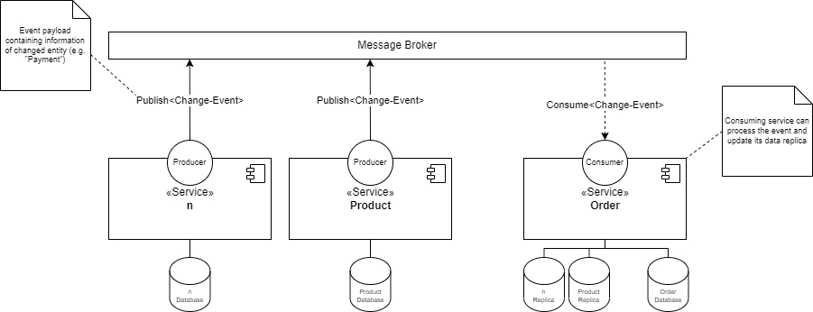
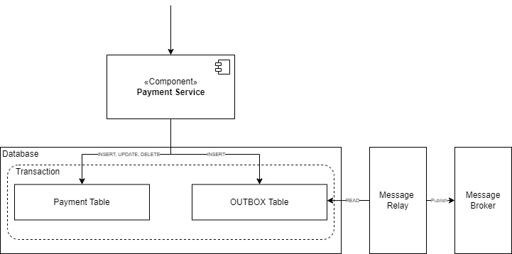
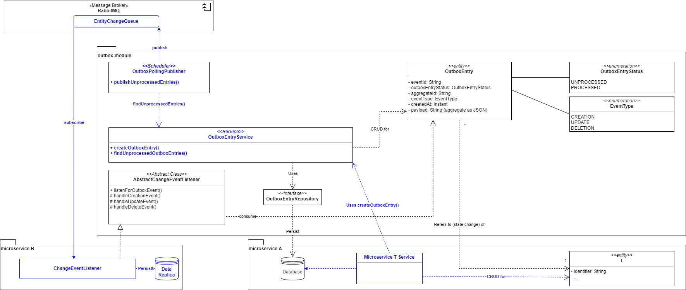

# Event-Data-Pump Concept & Implementation

This project contains the source code of the Event-Data-Pump implementation, as part of my bachelor thesis.

## About

The following section will quickly introduce to the context of this project.

### Context

Part of the work is to develop a concept that allows microservices to query data from different microservices, aggregate it, and return it in a collected form.

In contrast to monolithic applications, the data in a microservice application is usually not located in the same database, but distributed in different databases.
The microservices can therefore only access the data of the other microservices via their API. HTTP clients are usually developed for this purpose, which send synchronous requests to the API of the service to be consumed.

However, this traditional approach raises some problems:

- _Runtime-Coupling_: This coupling leads to the fact that during runtime, both microservices must be accessible
- _Design-Time-Coupling_: This coupling leads to the fact that the API of a microservice cannot be changed without all clients also having to be adapted accordingly

One approach that does not rely on synchronous composition is the _Event-Data-Pump_ pattern.

### Pattern Description
The _Event-Data-Pump_ pattern is to be implemented. 
This pattern used for implementing queries inside a microservice application.
At its core, data should be replicated from one microservice to other microservices.
This can be done, for example, via asynchronous events (messaging).
Every time an entity of a microservice changes, the microservice publishes a corresponding event that can be consumed by the other microservices.
In this way, other microservices can always keep their data replication in Synchronization.



## Implementation

The following sections will guide through the implementation of the _Event-Data-Pump_ pattern.

### Project Overview

To show that the developed concept can be implemented by means of patterns, this Minimal Working Example was created.
It is a multi-module maven project with Spring Boot and a RabbitMQ message-broker.

This sample microservice application is built as follows:

- `user`-module: contains the (event-producing) user-microservice 
- `product`-module: contains the (event-producing) product-microservice
- `order`-module: contains the (event-consuming) order-microservice as well as the query operation
- `outbox`-module: contains shared outbox code. This is a Spring Library that is configure to autoconfigure itself when present aon the classpath of a microservice 

### Implemented Components

This implementation consists of **four components**:

_On the producing side:_

- A Transactional Outbox
- A producer component

_One the consuming side:_

- A consumer component
- The query-operation

#### Transactional Outbox

To ensure that the publishing of the event and the state change will be both done atomically, the _Transactional Outbox_ pattern is implemented too.



#### Class Diagram

The following diagramm, shows the different classes and how they interact with each other.



## Usage of this Pattern

The following steps must be performed in order to use the concept:

### In the producing microservice
1. Add the `outbox`-module to the class path of the microservice
2. Inject the `OutboxEntryService` in all required service classes inside a microservice
3. In a service class, simple call `OutboxEntryService#createOutboxEntry();` and provide the reqired parameters

**Example: User-Creation with Outbox Implementation**
```java
@Service
public class UserServiceImpl {
    
    @Autowired
    private OutboxEntryService outboxEntryService;

    @Transactional
    public void createUser(UserDTO userDTO) {
        User user = new User();
        // ... Logic to assign and persist user ...
        outboxEntryService.createOutboxEntry(user.getIdentifier(), EventType.CREATION, user);
    }
}
```
### In the consuming microservice
1. Create a listener by extending the `AbstractChangeEventListener` class
2. Override the abstract methods and provide your logic to handle the data replica
3. Override `AbstractChangeEventListener#listenForOutboxEvent()` and annotate the method with `@RabbitListener` - use this to specify the queue name as well
4. In the methods body, simply call `super.listenForOutboxEvent()` and provide it with the `in`-parameter

**Example: User Listener**
```java
@Component
public class UserChangeListener extends AbstractChangeEventListener {

    private final MyService myService;
    
    @RabbitListener(queues = "<<Replace with Queue Name>>")
    public void listenForOutboxEvent(OutboxEntry in) {
        super.listenForOutboxEvent(in);
    }

    @Override
    protected Consumer<OutboxEntry> handleCreationEvent() {
        return myService::create;
    }

    @Override
    protected Consumer<OutboxEntry> handleUpdateEvent() {
        return myService::update;
    }

    @Override
    protected Consumer<OutboxEntry> handleDeleteEvent() {
        return myService::delete;
    }
}
```